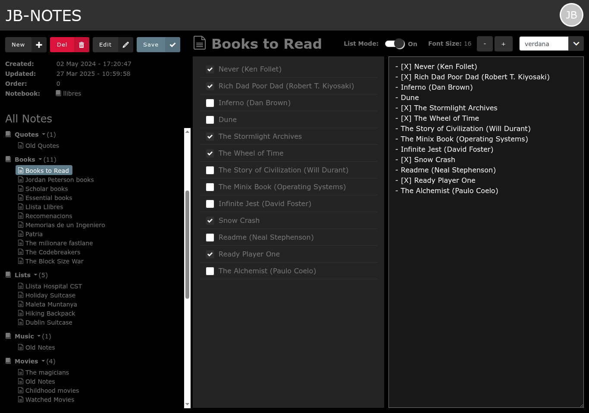
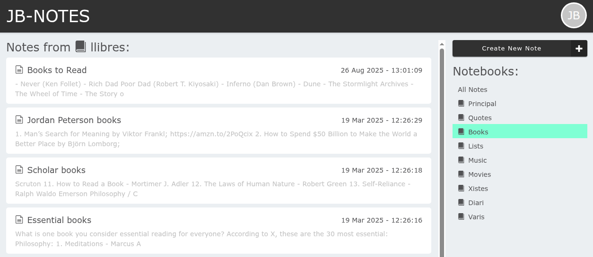
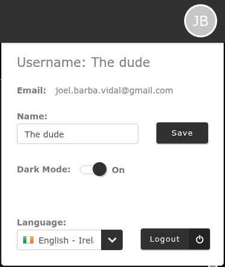

# JB-Notes (Web Client)

Web app to take notes (Evernote personal clone)<br/>
<br/>
As an Evernote user, I got anoyed enough with the _"join premium"_ popup as to dump the app and write my own.<br/>

This is meant to be a **simpler** and much **faster** way to take/keep notes. It doesn't have all the capabilites, but those basic ones that are more than enough for an easy note taking process.
Slow loading was another reason I dumped Evernote, so I made this app as light and performance as I could. It loads instantly on my browser, and the data takes less than 500ms to show up.<br/>





This project was developed with [Angular](https://angular.dev/) version 17.3.4.


## Backend Support

This project works with **Firebase** (Google Cloud), using its real time DB (Firestore).<br/>
To run it you need a `secrets.ts` file where to export your `firebaseConfig` object. 
<!-- Example:
```
export const firebaseConfig = {
  apiKey: "iyoisdoifksd768sd76f87s8dgsfd87g987a9s8",
  authDomain: "jb-notes-8d78s.firebaseapp.com",
  projectId: "jb-notes-8d78s",
  storageBucket: "jb-notes-8d78s.appspot.com",
  messagingSenderId: "876876876878",
  appId: "1:876876876878:web:78as76a8s7d68a7sd68a7s",
  measurementId: "G-S8D7F98798"
};
``` -->

It uses 2 main collections:
- **notebooks**
- **notes**

Every note must be located into one notebook, and they may have an order of apearence on that notebook.<br/>
The typings for the DB Model can be found in [interfaces.ts](./src/app/core/common/interfaces.ts):
```
export interface INotebook {
  id   ?: string;
  name  : string;
  order : string;
}

export interface INote {
  id?         : string;
  notebookId ?: string;
  title       : string;
  content     : string;
  order       : number;
  mode        : 'text' | 'list';
  created     : string;
  updated     : string;
}
```
> [!IMPORTANT]
> Notes are automatically saved on writing (with a `debounceTime(1500)`), and will also reload automatically from the server in real time, so no saving or loading action is required by the user.<br/>
Only the Notebook details require to be saved when changing them.

## Routing
When no note is selected, the app shows a list of all notes with their title, last update and a brief part of their content.<br/>
You can filter they by **notebook** on the right side panel, to display only those notes.



This is meant to be a starting point on route `/notes`, but it won't be the usual view when using the app.

Once you select a note, it takes you to `notes/[noteId]`, and the **_note edit view_** is displayed. That is the common view for the app.<br/>
Since the app will remember the last note that was edited, and will always redirect to that one on load, you won't see the list view unless you purposely go there. To help you with switching notes, the **_note edit view_** also provides a list of all notes, nested on all notebooks, on a left-side panel. You can click them to switch which note you are editing.


## Features
Notes are basic text, without any markup or enrichment. You can select the font type and font size these are displayed on.
This configuration is only saved on the current browser tab, so it rollback to the defaults when you open the app again.

### List Mode
Most of the notes are basics check lists.<br/>
In order to facilitate the handling of those, a doble view is provided with a 2 column layout for the same note content. On the left you will a rendered version of the list with html checkboxes you can click to "check" or "uncheck". On the right side you will see the note in raw text.<br/>
List items are defined by lines starting with a `-`. The check/uncheck value can be added with a `[x]` or `[ ]` characted after the hyphen.

### Line copy
You can duplicate the current line (where your cursor is currently located) with the shortcut `Ctrl + D`

### Line move
You move the current line (where your cursor is currently located) up or down, reordering it into the text, with the shortcut `Ctrl + Shift + ⬆️ | ⬇️`

### Dark Mode
You can toogle the color theme (light/dark) expanding the profile section (top-right corner).<br/>
<br/>


## ToDos
There are still some features I'd like to add in the future:
- [ ] Implement undo option (ctrl+z)
- [ ] Make left panel collapsable
- [ ] Handle offline (do not clear when going offline)
- [ ] Text Filter on the notes list
- [ ] Notes order on All Notes left panel
- [ ] Create/Delete notebook
- [ ] Font-family and size on the note DB
- [ ] Move dark mode on localstorage

## Further help
You can leave some comments on the project or contact [me](mailto:joel.barba.vidal@gmail.com) directly for more information.